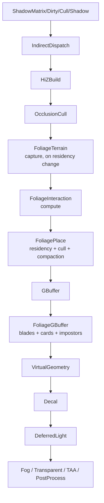

# Foliage rendering system

Status: implementation plan for [Helio #84](https://github.com/Far-Beyond-Pulsar/Helio/issues/84), 2026-07-30
Revised 2026-07-30 after a source audit of the plan's load-bearing assumptions. Three claims in
the first draft were wrong; §7.2, §10 and §12 changed materially. Corrections are marked
**[audit]** where they contradict something a reader may have already acted on.

Benchmark target: **exceed Unreal Engine 5's foliage stack**, not match it. Every design
decision below is measured against what UE actually does (Landscape Grass Type, Hierarchical
Instanced Static Mesh, Nanite foliage with World-Position-Offset, SpeedTree wind, Impostor
Baker plugin, Virtual Shadow Map foliage caching) and takes a position where we can beat it.

---

## 1. Where we start

Helio already has the hard parts of a GPU-driven foliage renderer; none of them are wired to
vegetation yet.

| Existing capability | Crate | What foliage needs from it |
|---|---|---|
| Two-stage meshlet cull + measured-error LOD, 8 LODs/object | `helio-pass-virtual-geometry` | Tree geometry, LOD selection, meshlet culling |
| Hi-Z pyramid + conservative max-depth occlusion test | `helio-pass-hiz`, `helio-pass-occlusion-cull` | Tile-level and cluster-level occlusion |
| 8-target G-buffer incl. velocity, SSS, extra | `helio-pass-gbuffer` | Foliage must fill the same targets to get lighting/TAA/SSAO for free |
| Indirect draw + count, feature-detected | `helio-pass-indirect-dispatch`, `helio-scenedb` | Zero-CPU draw submission |
| Shadow atlas, static/dynamic split, per-face dirty culling | `helio-pass-shadow` | Foliage shadow casting |
| Dense voxel terrain with a `MAT_GRASS` palette entry | `helio::terrain`, `helio-pass-voxel-mesh` | Runtime density source |
| Texture loading / asset compat | `helio-asset-compat` | Density map + impostor atlas authoring |
| Whole-repo WGSL validation in CI | `helio-core/tests/wgsl_validation.rs` | New shaders are covered the moment they land |
| Camera-relative scrolling sim + hitbox publication precedent | `helio-pass-water-sim` (`water_hitboxes`) | Exact data-flow template for the interaction field |

What is missing is everything vegetation-specific: placement, blade geometry, wind, impostors,
interaction, and the density/terrain authoring path. `BillboardPass` exists but is unusable for
vegetation as written — it composites into `pre_aa` **after** deferred lighting, so its output
receives no shadows, no SSAO, no GI and no correct TAA. Impostors must go through the G-buffer.

---

## 2. Where we beat Unreal

These are the specific claims this plan is accountable for.

1. **Placement never touches the CPU.** UE builds grass instance buffers on the CPU
   (`FGrassBuilder`, async tasks fed by the landscape grass map) and hitches when landscape
   components stream. Our placement is a compute shader over a residency-cached tile ring;
   the CPU cost is a constant-size uniform write per frame, independent of density.
2. **Foliage is occlusion-culled.** UE grass is distance- and frustum-culled only. We run the
   same conservative Hi-Z max-depth test the meshlet culler uses, at tile and 4×4-cluster
   granularity, so grass behind a wall costs nothing.
3. **Impostors are first-class and lit.** UE ships no built-in octahedral impostor baker (it is
   a plugin) and impostors commonly land in a forward/translucent path. Ours are hemi-octahedral
   atlases baked by `helio-bake` and rasterised **into the G-buffer** with reconstructed normal
   and depth-parallax, so they receive shadows, SSAO, SSR and GI identically to the mesh LODs.
4. **WPO does not break culling.** UE's answer to wind-displaced geometry falling outside its
   bounds is a global `WPO Disable Distance` and manually inflated bounds. We carry a per-type
   `wpo_extent` that dilates the object/meshlet cull radius, and we drop the dilation in the same
   frame we disable WPO, so bounds are never wrong in either direction.
5. **Wind-correct motion vectors.** Grass in UE writes no meaningful velocity, so TAA smears it.
   Our foliage vertex shaders evaluate wind at both `t` and `t - dt` and emit a true
   `prev_clip_position`, which is what makes dithered LOD cross-fades resolve cleanly instead of
   ghosting. **[audit]** This holds for the grass path, which writes the full 8-target G-buffer.
   It does *not* currently hold for trees: `VirtualGeometryPass` binds only 7 attachments and
   omits `gbuffer_velocity` entirely (`helio-pass-virtual-geometry/src/rendering.rs:387-423`), so
   VG geometry produces no motion vectors at all today. Adding velocity output to VG is a
   prerequisite for wind-animated trees being temporally stable, and is tracked as its own item
   in §15.
6. **Interaction is a shipped feature, not a sample-project hack.** Physics-driven bend with
   exponential recovery, on a snapped camera-relative field, available to every foliage type.
7. **The far ring has no geometry and no pop.** Past the last card LOD we stop drawing and hand
   the same density map to the terrain material as an albedo/roughness/normal perturbation. UE
   pops grass out at the cull distance; we dissolve into terrain shading.

---

## 3. Crate layout

Follows the established one-crate-per-pass rule, with shared POD types in a `*-core` crate
(precedent: `helio-voxel-core`, `helio-planet-voxel-core`).

```
crates/
  helio-foliage-core/            # POD GPU types, packing helpers, CPU mirrors of shader math
  helio-pass-foliage-terrain/    # top-down height/normal/mask capture for the active ring
  helio-pass-foliage-interaction/# interaction field update (compute)
  helio-pass-foliage-place/      # tile residency, placement, cluster cull, compaction (compute)
  helio-pass-foliage-gbuffer/    # blade / card / impostor rasterisation into the G-buffer
```

Extended, not replaced:

- `libhelio` — new `FrameResources` slots and the `GpuWind` uniform.
- `helio-pass-virtual-geometry` — WPO bounds dilation; later, a GPU-appended object range.
- `helio-bake` — impostor atlas baking.
- `helio-default-graphs` — conditional pass insertion.
- `helio` — public `Scene` authoring API (`FoliageType`, `FoliageLayer`, `FoliageInteractor`).
- `helio-core/src/shader/` — a shared `foliage_wind.wgsl` prelude module so grass, tree
  G-buffer and impostor shaders evaluate byte-identical wind and stay in phase.

New shaders are picked up by the existing repo-walking WGSL validation test automatically.

---

## 4. GPU data model

All sizes are asserted with `const _: () = assert!(size_of::<T>() == N)` in the style of
`libhelio::meshlet`.

### 4.1 Blade instance — 16 bytes

```rust
#[repr(C)]
pub struct GpuBladeInstance {
    /// Tile-local XZ as 2 × u16 unorm over the tile extent.
    pub packed_pos: u32,
    /// Terrain height offset (f16) | yaw (u16).
    pub packed_height_yaw: u32,
    /// Height scale (u8) | width scale (u8) | type id (u8) | variant (u8).
    pub packed_scale_type: u32,
    /// Tint (u8 ×2) | stable per-blade hash seed (u16).
    pub packed_tint_seed: u32,
}
```

1 M blades = 16 MiB. The seed is what makes dithered LOD transitions and wind phase stable
frame-to-frame — it is derived from the tile hash and the placement lane index, never from
frame state.

### 4.2 Tile header — 32 bytes

```rust
#[repr(C)]
pub struct GpuFoliageTile {
    pub tile_coord: [i32; 2],   // world tile grid coordinate
    pub blade_offset: u32,      // slab offset into the blade arena
    pub blade_count: u32,
    pub bounds_center_y: f32,   // XZ come from tile_coord; Y from the terrain capture
    pub bounds_half_y: f32,
    pub state: u32,             // Free | Placing | Resident | Evicting
    pub generation: u32,        // bumped on density/terrain edit, invalidates residency
}
```

### 4.3 Foliage type descriptor — 64 bytes

One entry per authored grass/mesh type, shared by placement and rasterisation.

```rust
#[repr(C)]
pub struct GpuFoliageType {
    pub density: f32,              // instances per m² at full weight
    pub height_range: [f32; 2],
    pub width_range: [f32; 2],
    pub slope_range: [f32; 2],     // cos(slope) acceptance band
    pub altitude_range: [f32; 2],
    pub lod_distances: [f32; 4],   // L0→L1, L1→L2, L2→L3, L3→terrain-shading
    pub wind_response: [f32; 3],   // trunk / branch / leaf band gains
    pub interaction_stiffness: f32,
    pub material_id: u32,
    pub density_layer: u32,        // slice in the density texture array
    pub kind_and_flags: u32,       // Blade | Card | Mesh; two-sided, casts-shadow, …
    pub mesh_or_impostor_id: u32,  // VirtualMeshId for Mesh kinds, atlas page otherwise
}
```

### 4.4 Wind state — 48 bytes, uniform

```rust
#[repr(C)]
pub struct GpuWind {
    pub direction_speed: [f32; 4],   // xyz normalised direction, w = base speed m/s
    pub gust: [f32; 4],              // amplitude, frequency, phase, turbulence scale
    pub time_prev_time: [f32; 2],    // t and t - dt — required for motion vectors
    pub _pad: [f32; 2],
}
```

`prev_time` is not decoration. It is the input that lets every foliage vertex shader compute
`prev_clip_position` correctly, which is the difference between clean TAA and the smeared grass
UE ships with.

### 4.5 Buffers owned by `FoliagePlacePass`

| Buffer | Contents | Sizing |
|---|---|---|
| `tile_table` | `GpuFoliageTile[]` | ring capacity, e.g. 4096 tiles |
| `blade_arena` | `GpuBladeInstance[]` | slab-allocated, budget-capped (default 24 MiB) |
| `cluster_bounds` | one sphere per 4×4 blade cluster | `blade_capacity / 16` |
| `visible_blades[4]` | per-LOD compacted `u32` blade indices | worst-case per LOD bucket |
| `foliage_indirect` | 4 × `DrawIndirectArgs` + 4 counters | 96 B |
| `place_queue` | tiles scheduled for placement this frame | bounded by `max_tiles_per_frame` |

Every capacity is a hard ceiling with an overflow counter, exactly like
`VirtualGeometryBudget::clamp_draw_count` and `draw_counters[2]` — silent truncation that looks
like a culling bug is the failure mode we are explicitly designing against.

### 4.6 `FrameResources` additions (`libhelio::frame`)

```rust
pub foliage: Tracked<FoliageFrameData<'a>>,      // types, layers, wind, config, generation
pub foliage_terrain: Tracked<FoliageTerrainViews<'a>>,  // height, normal, mask
pub foliage_interaction: Tracked<&'a wgpu::TextureView>,
pub foliage_interaction_sampler: Tracked<&'a wgpu::Sampler>,
pub foliage_interactors: Tracked<&'a wgpu::Buffer>,
pub foliage_interactor_count: u32,
```

All added to `FrameResources::empty()` and `reset_tracking()`. `foliage_interactors` follows
the `water_hitboxes` / `water_hitbox_count` pattern verbatim.

---

## 5. Terrain integration

The placement shader must not know what kind of terrain it is standing on. Helio has at least
three surface representations today (dense voxel mesh, voxel raymarch bricks, planetary voxel
pages) and will gain more.

`FoliageTerrainPass` renders a **top-down capture of the active foliage ring**:

- `Rg16Float` height + slope, `Rgba8Unorm` packed world normal + material id, at 4 texels/m
  over the ring extent (default 256 m → 1024² textures, 3 MiB total).
- Redrawn only for tiles whose residency or generation changed, into a scrolling
  camera-relative atlas snapped to the texel grid (no swimming under camera motion).
- Sources are pluggable: the voxel mesh pass's extracted triangles, a heightmap texture, or a
  planetary voxel page set. Each source implements a small `FoliageTerrainSource` trait that
  contributes draws to this one pass.

This is a deliberate cost (one extra ortho pass on residency change) bought for a large
architectural simplification: placement, interaction and the far-ring terrain-shading fallback
all read one uniform representation, and any future terrain type gets foliage for free.

Density authoring layers on top:

- **Painted**: `R8Unorm` density textures, one array slice per foliage type, loaded through
  `helio-asset-compat::texture_loader`.
- **Procedural**: slope/altitude/material rules from `GpuFoliageType`, evaluated against the
  capture. The voxel `MAT_GRASS` palette entry becomes a real density source here.
- **Exclusion**: painted mask plus runtime exclusion volumes (roads, building footprints).

Final weight is `painted × procedural × (1 - exclusion)`, evaluated per candidate.

---

## 6. Placement and culling

### 6.1 Residency

The world is a grid of 8 m tiles. A ring of tiles around the camera is resident. On camera
motion, tiles entering the ring are pushed to `place_queue`; tiles leaving are freed LRU. At
most `max_tiles_per_frame` (default 24) are placed per frame, so churn is amortised and a
teleport degrades to a few frames of progressive fill-in rather than a hitch.

Placement for one tile: one workgroup per tile, each lane evaluating a stratified candidate
(jittered grid, blue-noise offset from the seed hash) against the density weight, writing
survivors with `atomicAdd` into that tile's slab. Deterministic: same tile coordinate, same
generation, same seed ⇒ byte-identical blade list, on any GPU. This is directly testable and
is a CI test.

**Why residency caching wins:** regenerating every visible blade every frame is the common
GPU-grass shortcut and costs ~1 ms at 1 M blades. Caching makes the steady-state placement cost
zero and the moving-camera cost proportional to ring perimeter, not ring area.

### 6.2 Per-frame cull

Two compute dispatches, recorded on `ctx.encoder_ptr` (the main render encoder), **not**
`chain_transparent`. **[audit]** The first draft made them `chain_transparent` so they could sit
inside a subpass chain. That is wrong for this workload: `chain_transparent` passes must record
exclusively on the separate compute encoder, and the two encoders are submitted as
`[compute_encoder, encoder]` (`helio-core/src/graph/execution.rs:614`), so *all* such work runs
before *all* render-encoder work. A `chain_transparent` foliage cull would therefore read the
**previous** frame's Hi-Z. `HiZBuildPass` and `OcclusionCullPass` both deliberately use
`ctx.encoder_ptr` for exactly this reason and neither opts in. We follow them. These passes
precede the G-buffer and never need to sit inside an open chain, so we give up nothing.

1. **Tile cull** — one lane per resident tile: frustum test against the tile AABB dilated by
   `max_height + wpo_extent`, then the conservative Hi-Z max-depth test copied from
   `vg_cull.wgsl` (including the `hiz_valid` frame-0 guard — an untouched depth texture reads
   as 0.0 and this engine's near-is-0.0 convention would otherwise cull the entire world).
2. **Cluster cull + compaction** — one lane per 4×4 blade cluster: frustum, Hi-Z, distance-to-LOD
   classification, then `atomicAdd` append into the four per-LOD `visible_blades` buffers. A
   3-lane finalize dispatch converts counters to `DrawIndirectArgs`.

At 1 M blades this is 62 500 cluster lanes ≈ 977 workgroups. Cheap.

### 6.3 LOD ladder

| LOD | Range (default) | Geometry | Verts/instance |
|---|---|---|---|
| L0 | 0–8 m | 5-segment blade, `TriangleStrip` | 11 |
| L1 | 8–20 m | 3-segment blade | 7 |
| L2 | 20–45 m | single textured card | 4 |
| L3 | 45–120 m | clump card (one per 4×4 cluster) | 4 |
| — | >120 m | no geometry; terrain material perturbation | 0 |

No vertex or index buffer is bound. Each LOD is one `draw_indirect(vertex_count, instance_count)`
with `TriangleStrip` topology — instancing restarts the strip per instance, so a blade is a
single primitive with no degenerate triangles and no index buffer. Four draws total for all
grass in the world, on every backend including WebGPU (which has no
`MULTI_DRAW_INDIRECT_COUNT`).

Per-instance strip restart is guaranteed by the WebGPU spec's primitive-assembly algorithm —
assembly runs per instance, and a strip is split on the restart value only for *indexed* draws —
so a non-indexed instanced strip draw cannot span an instance boundary. Set
`strip_index_format: None` on the `PrimitiveState`: it has no effect on non-indexed draws, but on
Vulkan a `Some` value sets `primitiveRestartEnable`, and `None` is the correct state here.

**Seamless transitions** are three mechanisms stacked:

- **Scale-in**: a blade entering the ring interpolates height 0→1 over a 2 m band, so nothing
  ever appears at full size.
- **Stochastic cross-fade**: over the LOD band both representations draw, each alpha-tested
  against `hash(seed) + blue_noise(pixel, frame)`. TAA resolves it — and resolves it correctly
  because of the wind-aware motion vectors in §4.4.
- **Card orientation continuity**: L2/L3 cards inherit the L1 blade's yaw so silhouette
  direction does not flip at the boundary.

---

## 7. Trees, virtual geometry and impostors

### 7.1 Mesh foliage rides the existing meshlet path

A `Mesh`-kind foliage type references a `VirtualMeshId`. Its instances become `GpuVgObject` +
`GpuInstanceData` entries, so tree LOD selection, meshlet culling and Hi-Z occlusion are the
code that already ships — measured simplification error in output pixels, eight LODs, per-object
selection, no new LOD system.

### 7.2 WPO bounds dilation (change to `helio-pass-virtual-geometry`)

Wind displaces leaves outside the object's bounding sphere and outside each meshlet's sphere.

**[audit] `GpuVgObject` has no room and must not be touched.** Its fields sum to exactly 128
bytes (16 + 16 + 32 + 32 + 32) with zero padding, and the field named `reserved` is *not* spare —
it is live per-frame GPU scratch that the cull shader calls `selected_lod_plus_one`,
written every frame by `cs_select_objects` (`vg_cull.wgsl:378`) and read by `cs_cull_meshlets`
as the object-visibility gate (`vg_cull.wgsl:404-405`). Reusing it breaks VG culling outright.

`wpo_extent: f32` goes in **`InstanceCullData`** instead (`helio-pass-virtual-geometry/src/lib.rs:149`),
growing it 16 → 20 bytes. That is the right home regardless of the size accident: the struct is
`pub(crate)` to the VG pass so there is no public ABI or cross-crate breakage, its size is pinned
by an ordinary test assertion rather than a `const _` assert, it is scalar-only so a 20-byte
stride is legal WGSL, and it is *already bound and already in a register at both dilation sites*
(binding 10, read in `cs_select_objects` at `:335` and in `cull_meshlet` at `:154`). It is derived
per frame from `GpuInstanceData` in `InstanceCullData::from_instance`, so publishing it is a
one-line change. The cost is storing a per-type constant per-instance — 400 KiB at 100 k trees.

With the extent available, the dilation is:

- `cs_select_objects`: `world_radius += wpo_extent * max_scale`.
- `cull_meshlet`: same dilation on the meshlet sphere.
- Past `wpo_disable_distance`, the vertex shader stops applying WPO **and** the culler stops
  dilating, in the same frame, driven by the same distance constant.

This is the failure UE papers over with a manual bounds scale. Getting it exactly right is a
handful of lines and removes a whole class of edge-of-screen popping.

### 7.3 Hemi-octahedral impostors

Baked by `helio-bake`: render the LOD0 virtual mesh from an 12×12 hemi-octahedral direction grid
into three atlas pages —

- `Rgba8UnormSrgb`: base colour + coverage alpha
- `Rg8Unorm`: octahedral-encoded world normal
- `R8Unorm`: view-depth for parallax

Stored as a **single `texture_2d_array`, not a binding array**, because `MAX_TEXTURES` is 16 on
wasm32, Metal and Android (see `helio-pass-virtual-geometry::MAX_TEXTURES`). One binding, every
platform, no per-platform shader rewrite.

Drawn by `FoliageGBufferPass` as a camera-facing quad with three-view barycentric blending and
depth parallax, writing albedo / normal / ORM / emissive / velocity — the full G-buffer. It is
therefore shadowed, ambient-occluded, screen-space-reflected and temporally stable, which a
`BillboardPass`-style post-lighting composite can never be.

Transition from the deepest mesh LOD to the impostor uses the same stochastic cross-fade as
grass, over a band sized so the impostor's silhouette error is under one pixel at the switch
distance.

### 7.4 GPU-appended VG objects (phase 4, has a fallback)

To make tree placement as CPU-free as grass, `FoliagePlacePass` must append `GpuVgObject` and
`GpuInstanceData` entries directly, with `VirtualGeometryPass` dispatching from a GPU counter.
That requires:

- a reserved GPU-writable range at the tail of the VG object/instance buffers,
- `dispatch_workgroups_indirect` for `cs_select_objects` and `cs_cull_meshlets`,
- a GPU-built `GpuVgWorkItem` list for the appended range.

This is the riskiest item in the plan. The fallback — CPU publication through the existing
`VgFrameData` path — is fine to roughly 100 k tree instances and is what ships until phase 4
lands. Nothing else in the plan depends on phase 4.

---

## 8. Wind

A three-band model, implemented once in `helio-core/src/shader/foliage_wind.wgsl` and included
by every foliage shader through the existing `shader::resolve` prelude mechanism:

- **Trunk/stem sway** — low-frequency, large amplitude, gust-modulated, coherent across a whole
  instance. Driven by a world-space noise sampled at the instance origin so neighbours move
  together rather than independently (the artefact that makes procedural wind read as "boiling").
- **Branch flutter** — mid-frequency, per-branch phase from the vertex's distance along the
  stem.
- **Leaf jitter** — high-frequency, small amplitude, phase from the per-blade/per-leaf seed.

Amplitude scales with the vertex's normalised height along the blade/branch, so the root never
moves and the tip moves most. Gust is a single global scalar with turbulence added per world
position, so a gust front visibly crosses a field instead of every blade pulsing in unison.

Every shader evaluates the model at `wind.time` and `wind.prev_time` and outputs both clip
positions. This costs a handful of ALU and is what makes TAA behave.

---

## 9. Interaction

`FoliageInteractionPass` maintains a camera-relative `Rgba16Float` field (default 512²
covering 64 m, snapped to the texel grid):

- **RG**: horizontal displacement direction × magnitude
- **B**: vertical crush amount
- **A**: recovery timer

Per frame:

1. Scroll history by the camera's snapped texel delta (a copy, not a resample — no swimming).
2. Decay: `value *= exp(-dt / tau)`, `tau` from the foliage type's `interaction_stiffness`.
3. Splat each `FoliageInteractor` (world position, radius, velocity) published by `Scene` into
   the field, taking the max of existing and new displacement so fast passes leave a full track.

Foliage vertex shaders sample the field, project the displacement into the blade's local frame,
and bend proportional to normalised height. Outside the field, foliage is simply unbent — no
seam, because the field's edge is always ≥ 32 m from the camera and grass geometry ends at
120 m with the displacement already decayed to zero at the boundary.

`Scene` gets `add_foliage_interactor` / `update_foliage_interactor`, mirroring the existing
water-hitbox API so the physics-side integration in Pulsar-Native is a one-liner per body.

---

## 10. Graph integration



Declarations:

```rust
// FoliagePlacePass
fn reads(&self)  -> &'static [&'static str] { &["hiz", "foliage_terrain", "main_scene"] }
fn writes(&self) -> &'static [&'static str] { &["foliage_draws"] }

// FoliageGBufferPass
fn reads(&self)  -> &'static [&'static str] { &["foliage_draws", "foliage_interaction", "gbuffer"] }
fn writes(&self) -> &'static [&'static str] { &["gbuffer"] }
```

`FoliageGBufferPass` returns a `render_pass_descriptor` with `LoadOp::Load` on all eight
G-buffer targets and the shared depth attachment, so the executor can fuse it into the
G-buffer subpass chain rather than resolving and reloading.

**[audit] Pass order matters and the first draft had it wrong.** `FoliageGBufferPass` must sit
**immediately after `GBufferPass`, before `VirtualGeometry`**, and must return the byte-identical
eight views in the same order. Chain formation requires an exact attachment-view match
(`helio-core/src/graph/scheduling.rs:82-88`), and `VirtualGeometryPass` binds only **seven**
attachments — it omits `gbuffer_velocity`. It is also a raster pass, so it is not
`chain_transparent` and the chain scan cannot skip over it. Placing foliage after VG, as the
first draft's diagram did, makes the promised fusion impossible. (The stale comment at
`scheduling.rs:55-57` claiming GBuffer and VirtualGeometry fuse together is wrong for the same
reason — they do not fuse today either.)

### Shadows

**[audit] Virtual geometry does not cast shadows today.** The first draft assumed tree shadows
came free "via the existing shadow indirect path". They do not. `ShadowPass` draws exclusively
from the general scene mesh mega-buffers (`main_scene.mesh_buffers`) using indirect commands
built on the CPU in `helio/src/scene/objects/rebuild.rs` by walking the regular object arena. VG
objects live in a separate arena that path never visits. Independently verified: the string
`shadow` does not appear anywhere in `helio-pass-virtual-geometry/src/` or its shaders, and
`meshlet`/`virtual` appear nowhere in the three shadow pass crates.

Making VG cast shadows is a **new workstream comparable in size to `helio-pass-shadow-cull`**: a
shadow-view meshlet cull (VG culls against the camera frustum and camera Hi-Z only), per-face VG
indirect buffers and counts with the `MULTI_DRAW_INDIRECT_COUNT` fallback duplicated, a
depth-only pipeline over the VG vertex format, and integration with the static/movable atlas
split and `ShadowDirtyPass`, which keys off a `movable_objects_generation` concept VG objects do
not participate in. It is now its own phase (§15), and it is a prerequisite for tree shadows —
not for grass.

Foliage shadow casting is otherwise deliberately staged, because this is where UE's
implementation is weakest and where a naive port is expensive:

- **Trees**, until the VG shadow phase lands, cast via a **proxy-mesh double publication**: the
  VG object drives the G-buffer, and a low-LOD proxy is published as an ordinary scene object
  that the existing shadow path already handles. This is cheap, unblocks phase 4, and is
  effectively what UE does with its own shadow proxies. Wind is evaluated at reduced amplitude in
  the shadow vertex shader (full amplitude doubles atlas invalidation for no visible gain at
  shadow resolution).
- **Grass** casts only within the first cascade, only at L2 cards, into the **dynamic** atlas.
  Wind is frozen for the shadow draw, which keeps grass eligible for the static atlas's caching
  in a later optimisation pass — a strictly better trade than UE, which re-renders wind-animated
  grass shadows every frame.
- **Beyond cascade 0**, grass contributes no shadow. It contributes AO instead, via a density
  term folded into the terrain material's ORM output — visually closer to ground truth than
  UE's hard grass-shadow cutoff, and free.

### Zero overhead when absent

Three independent guarantees, each with a test:

1. `RendererConfig::enable_foliage == false` ⇒ `helio-default-graphs` never constructs the
   passes. Test asserts graph pass count is unchanged.
2. Passes present but no foliage types registered ⇒ `prepare()` early-returns on an unwritten
   `frame.foliage` slot, `execute()` records no commands, `declare_resources` allocates nothing.
   Test asserts zero GPU timestamps attributed to the foliage passes.
3. Foliage types registered but ring empty ⇒ four `draw_indirect` calls with
   `instance_count == 0`. Measured cost < 0.02 ms.

---

## 11. Public API (`helio::Scene`)

```rust
let grass = scene.add_foliage_type(FoliageTypeDescriptor {
    kind: FoliageKind::Blade,
    material: grass_mat,
    density: 40.0,                       // per m²
    height_range: 0.15..0.45,
    slope_range: 0.0..35f32.to_radians(),
    lod_distances: [8.0, 20.0, 45.0, 120.0],
    wind_response: [0.0, 0.3, 1.0],
    interaction_stiffness: 6.0,
    ..Default::default()
});

let oak = scene.add_foliage_type(FoliageTypeDescriptor {
    kind: FoliageKind::Mesh { virtual_mesh: oak_mesh, impostor: oak_impostor },
    density: 0.02,
    wpo_extent: 0.6,
    ..Default::default()
});

scene.add_foliage_layer(FoliageLayer {
    types: vec![grass, oak],
    density_map: Some(density_tex),      // R8, optional
    exclusion_map: Some(roads_tex),
    bounds: world_bounds,
    seed: 0x5EED,
});

scene.set_wind(Wind { direction: Vec3::X, speed: 4.0, gust_amplitude: 0.6, ..Default::default() });

let player = scene.add_foliage_interactor(FoliageInteractor { position, radius: 0.5, velocity });
scene.update_foliage_interactor(player, position, velocity);   // per tick, O(1)
```

`FoliageQuality::{Low, Medium, High, Ultra}` scales ring radius, density multiplier, LOD
distances and cluster-cull granularity, mirroring `LodQuality`'s existing shape.

---

## 12. Performance budget

Target from the issue: **1 M blades under 3 ms GPU at 1080p desktop.** Reference tier is the
same one the existing `render_timing_snapshot` test uses.

Steady-state distribution across the LOD ring at 40 blades/m² and a 120 m radius:

| Stage | Work | Budget |
|---|---|---|
| Terrain capture | amortised, residency-change only | 0.05 ms |
| Interaction field | 512² compute + ≤64 splats | 0.05 ms |
| Placement | ≤24 tiles/frame × 1 workgroup | 0.20 ms |
| Tile + cluster cull | ~1 000 workgroups | 0.15 ms |
| L0 raster | 60 k × 11 verts | 0.55 ms |
| L1 raster | 200 k × 7 verts | 0.60 ms |
| L2/L3 raster | 740 k × 4 verts | 0.95 ms |
| Impostors | ~2 k trees | 0.15 ms |
| **Total** | | **2.70 ms** |

Headroom to the 3.0 ms gate: 0.30 ms.

**[audit] The first draft's main lever was invalid.** It proposed a grass pipeline writing 5 of
the 8 G-buffer targets. A pipeline's fragment targets must match the render pass's colour
attachments in both count and format — `RenderPassContext::check_compatible` compares the lists
with strict element-wise equality — so a 5-target pipeline requires its own render pass, which
forfeits subpass fusion. Breaking the chain forces a tile store and reload of every touched
attachment; at 1080p and 48 bytes/sample that is ~100 MiB each way on a tile-based GPU, far more
than the lever was meant to save.

The lever that actually works: keep an **8-target pipeline with identical formats** and set
`write_mask: ColorWrites::empty()` on the three grass does not write (lightmap_uv, sss, extra),
omitting those `@location`s from the fragment shader. wgpu's fragment-interface check iterates
shader outputs and does not demand one per declared target. The empty write mask is **mandatory,
not cosmetic** — unwritten fragment outputs are undefined, so without it those three G-buffer
channels get corrupted. This recovers fragment ALU and ROP write bandwidth only; attachment
memory and tile footprint are fixed by the shared render pass, so budget the saving well under
the 0.35 ms the first draft assumed.

Remaining levers: raise cluster granularity from 4×4 to 8×8, and pull in the L2/L3 ring.

The gate is enforced in CI as a hard failure, extending
`helio-core/tests/render_timing_snapshot.rs` with a foliage scene, and benchmarked in
`helio-scenedb/benches/pass_timing.rs`.

---

## 13. Platform matrix

| Constraint | Where it bites | Answer |
|---|---|---|
| No `MULTI_DRAW_INDIRECT_COUNT` on WebGPU | draw submission | Design uses exactly 4 `draw_indirect` calls; no multi-draw anywhere in the grass path |
| `MAX_TEXTURES == 16` on wasm/Metal/Android | impostor atlas | Single `texture_2d_array`, one binding |
| No 64-bit atomics | compaction | All counters are `atomic<u32>` |
| Tight storage-buffer limits on mobile | arenas | `FoliageQuality::Low` caps the blade arena at 4 MiB and the ring at 48 m |
| **[audit]** `dispatch_workgroups_indirect` availability | phase 4 VG append | Nothing to detect — it needs only `DownlevelFlags::INDIRECT_EXECUTION`, part of the WebGPU baseline, and `helio-pass-sdf` already uses it in production. The §7.4 risk is plumbing, not availability |
| Tile-based mobile GPUs hate alpha test | blade raster | Opaque blade geometry (no alpha) at L0/L1 — only cards need cutout. Cutout uses stochastic alpha-test + TAA resolve, per §6.3 |
| **[audit]** `max_color_attachment_bytes_per_sample` | the whole G-buffer | Helio's 8 targets cost **48 bytes/sample** against a **32-byte** WebGPU/wgpu guaranteed floor. Pre-Apple4 Metal (Intel Macs, older iOS) also reports 32. DX12 gives 128, Vulkan typically 128 |

**[audit] The first draft claimed "every pass compiles and runs on all targets". That is not
true today and foliage cannot make it true.** The existing 8-target G-buffer already exceeds the
32-byte guaranteed `max_color_attachment_bytes_per_sample` floor, so on any adapter reporting
baseline limits — browsers, pre-Apple4 Metal — G-buffer pipeline creation fails. Helio's
`required_wgpu_limits` never names that limit, so the shortfall surfaces as an opaque pipeline
error rather than a clear failure at device creation. Foliage inherits this constraint verbatim;
it does not introduce it. Worth a separate issue to fail loudly at startup.

Alpha-to-coverage is **not** available and has been removed from this plan: the G-buffer and VG
pipelines are single-sampled everywhere (`MultisampleState::default()`, `count: 1`, every
`resolve_target: None`), and WebGPU rejects `alphaToCoverageEnabled` when `count == 1`. Helio
anti-aliases with TAA/FXAA/SMAA post-passes, not MSAA.

Beyond those two constraints nothing is `#[cfg]`-ed out; quality presets are the only platform
difference.

---

## 14. Testing

Mirrors the conventions already in the repo rather than inventing a new harness.

- **Layout asserts** — `const _: () = assert!(size_of::<GpuBladeInstance>() == 16)` etc., plus a
  `gpu_foliage_layouts_are_stable` test, exactly like `libhelio::meshlet::tests`.
- **CPU mirrors of shader math** — `select_blade_lod`, `pack_blade`, `wind_offset` implemented
  in `helio-foliage-core` and unit-tested, in the style of
  `helio_pass_virtual_geometry::select_object_lod`. The WGSL calls the same formulas.
- **Placement determinism** — same tile + generation + seed ⇒ identical blade list, asserted
  across two dispatches and against a CPU reference.
- **Cull equality** — GPU cull result vs CPU reference over a randomised camera sweep, following
  `helio-scenedb/tests/cull_equality.rs`.
- **Overflow behaviour** — arena and draw-list saturation increments the overflow counter and
  never writes out of bounds, following `helio-scenedb/tests/overflow_clamp.rs`.
- **WGSL validation** — automatic; the repo-walking test picks up new shaders with no
  registration.
- **Golden images** — impostor bake output, LOD transition band at three camera distances, wind
  at a fixed time, interaction footprint recovery curve.
- **Zero-overhead** — the three assertions in §10.
- **Perf gate** — §12, failing CI above 3.0 ms.

---

## 15. Milestones

Each phase is independently shippable and leaves the engine in a working state.

| Phase | Deliverable | Acceptance |
|---|---|---|
| **1. Foundations** | `helio-foliage-core` types, `FrameResources` slots, `Scene` API, `FoliageTerrainPass` | Terrain capture renders correctly over voxel terrain; zero-overhead tests pass |
| **2. Grass** | `FoliagePlacePass` + `FoliageGBufferPass`, L0–L3, residency cache, tile/cluster cull | 1 M blades render, fully lit and shadowed; deterministic placement test passes |
| **3. Wind + interaction** | `foliage_wind.wgsl` prelude, `FoliageInteractionPass`, motion vectors | No TAA ghosting on moving grass; footprint recovery matches golden curve |
| **4. Trees** | Mesh foliage via VG, `wpo_extent` in `InstanceCullData`, `wpo_disable_distance`, proxy-mesh shadow publication | Wind-displaced leaves never cull at screen edges; tree LOD selection matches VG debug histogram; trees cast shadows via proxy |
| **4b. VG velocity** | Add `gbuffer_velocity` as an 8th target to `VirtualGeometryPass` | VG geometry writes motion vectors; wind-animated trees are temporally stable under TAA |
| **5. Impostors** | `helio-bake` hemi-octahedral baker, impostor G-buffer pipeline, cross-fade | Impostor and mesh LOD are within 1 px silhouette error at switch distance; impostors receive shadows |
| **6. Density authoring** | Painted density/exclusion arrays, procedural rules, editor brush hookup in Pulsar-Native | Painting density updates foliage within one frame of the affected tiles |
| **7. VG shadow casting** | Shadow-view meshlet cull, per-face VG indirect + counts, depth-only VG pipeline, `ShadowDirty` integration | Trees cast shadows at their selected VG LOD; proxy-mesh publication from phase 4 retired |
| **8. Optimisation** | Perf gate green, far-ring terrain-shading fallback, static shadow-atlas eligibility for frozen-wind grass | ≤ 3.0 ms at 1 M blades on the reference tier; no visible pop at any LOD boundary |

Phases 1–3 deliver the issue's core requirement (grass) and depend on none of the audit's
findings. Phases 4–5 deliver tree LOD and impostors. Phase 6 is authoring. **Phase 7 is new**,
promoted out of a one-line assumption in §10 that turned out to be false; it is genuinely
optional for shipping grass and can be deferred behind the proxy-mesh fallback. Phase 8 is where
we clear the benchmark.

**[audit]** The depth-prepass mention in the first draft is dropped.
`crates/helio-pass-depth-prepass` is an orphan crate: nothing depends on it and it appears in no
shipped graph. Wiring it would also introduce a new chain break ahead of the G-buffer, so it is
not a free optimisation and is out of scope here.

---

## 16. Risks

| Risk | Impact | Mitigation |
|---|---|---|
| GPU-appended VG objects (§7.4) needs indirect dispatch plumbing through `VirtualGeometryPass` | Phase 4 slips | Fallback CPU publication ships first and is sufficient to ~100 k trees; nothing depends on the GPU path |
| Overdraw at grazing camera angles blows the raster budget | Perf gate fails | LOD ranges driven by projected screen coverage, not raw distance; stochastic alpha-test + TAA (not alpha-to-coverage — there is no MSAA path); 8×8 cluster fallback |
| **[audit]** VG casts no shadows today | Tree shadows are a phase, not a wiring change | Proxy-mesh double publication in phase 4 unblocks trees immediately; phase 7 does it properly |
| **[audit]** G-buffer exceeds the 32-byte guaranteed attachment budget | No WebGPU/older-Metal support | Pre-existing, not foliage-introduced. Track separately; foliage must not be blamed for or blocked on it |
| TAA ghosting on stochastic cross-fades | Visible smearing | Correct wind-aware motion vectors (§4.4, §8) — this is why `prev_time` is in the uniform |
| Blade arena exhaustion in dense scenes | Silent geometry loss | Hard capacity + overflow counter + debug view, same contract as `DEFAULT_MAX_PUBLISHED_MESHLETS` |
| Terrain capture cost on fast camera motion | Frame spikes | `max_tiles_per_frame` budget; capture is amortised and progressive |
| Shadow cost for foliage | Doubles frame cost naively | Staged plan in §10: cards only, cascade 0 only, frozen wind, AO fallback beyond |

---

## 17. Repository logistics

`Helio` is consumed by `Pulsar-Native` as a submodule at `crates/renderer/helio`. Work lands as
PRs against `Far-Beyond-Pulsar/Helio`, one per phase; `Pulsar-Native` bumps the submodule pin
once a phase is merged and its tests are green. The editor-side density brush in phase 6 is the
only change that touches `Pulsar-Native` directly.
