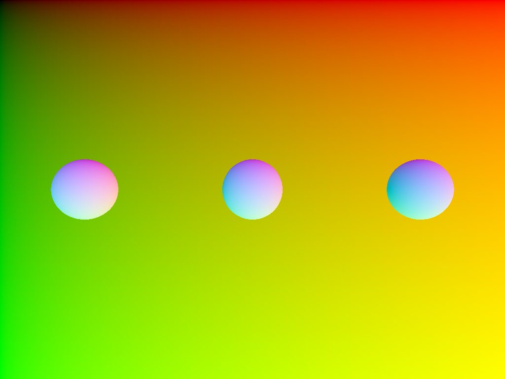

# ray-aabb

This example ray-traces AABB geometry from an acceleration structure, then turns
each hit into a sphere: the compute shader uses hardware ray queries for the
AABBs, fits a sphere inside each box, and resolves it with ray-sphere
intersection.

NOTE: The Metal backend does not support AABB intersections in ray queries yet,
so this example will not work.

## To Run

```
cargo run --bin wgpu-examples ray_aabb_compute
```

## Screenshots


